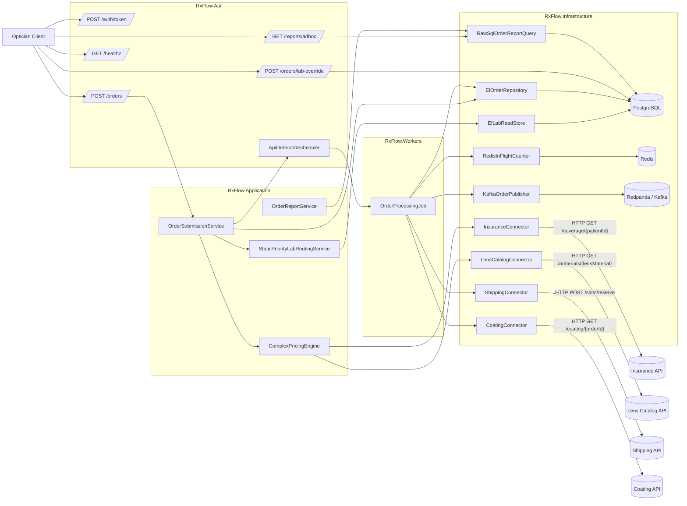

# RxFlow Source Data-Flow Diagram

## Source Anchors
- API endpoints and startup wiring: `RxFlow.Api/Program.cs`
- Order entry flow: `RxFlow.Application/Orders/OrderSubmissionService.cs`
- Pricing flow: `RxFlow.Application/Pricing/ComplexPricingEngine.cs`
- Lab routing flow: `RxFlow.Application/Labs/StaticPriorityLabRoutingService.cs`
- Background processing flow: `RxFlow.Workers/Processing/OrderProcessingJob.cs`
- Repository and persistence: `RxFlow.Infrastructure/Persistence/*.cs`
- Redis/Kafka/connectors/reporting: `RxFlow.Infrastructure/Redis/*.cs`, `RxFlow.Infrastructure/Messaging/*.cs`, `RxFlow.Infrastructure/Connectors/*.cs`, `RxFlow.Infrastructure/Reporting/*.cs`
